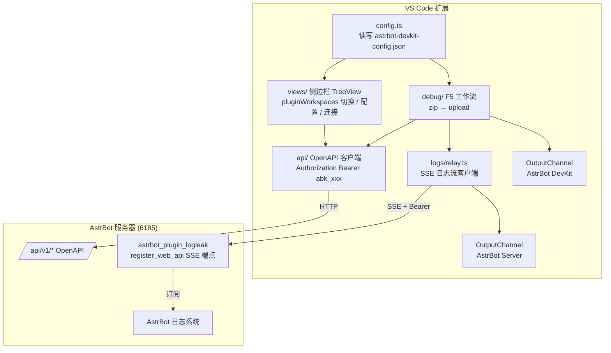

# AstrBot DevKit In VSCode — 设计文档

> 状态:草案 v5 | 日期:2026-08-06 | 适用范围:本扩展后续实现
> 本文档中的 OpenAPI 信息均以 AstrBot 官方文档与 `/api/v1/openapi.json`(v4.18+)为准,已在 2026-08-06 核对。

## 1. 背景与目标

本扩展的目标是让 AstrBot 插件开发在 VS Code 内闭环:环境初始化、插件模板下载、本地开发、一键推送到服务器、实时观察服务器日志进行调试,尽量不离开编辑器。

核心能力:

1. **工作区配置 + 侧边栏**:使用 `./.vscode/astrbot-devkit-config.json` 管理连接信息;侧边栏用于切换 `pluginWorkspaces`、按 `_conf_schema.json` 规范编辑并提交插件配置、连接服务器。
2. **OpenAPI 插件管理**:使用 `astrbotServer` + `astrbotAPIkey` 通过 AstrBot OpenAPI 读写/推送插件配置。
3. **F5 Debug 工作流**:一键完成打包 → 压缩包推送 → 打开服务器日志观察,直到用户点击停止。
4. **服务器日志投射**:通过 AstrBot 服务器插件把服务器日志投射到专用 OutputChannel,是 F5 Debug 流程的组件。

`InitEnv`(环境初始化)逻辑保持现状,不在本文档范围内。

## 2. 总体架构



两条链路,统一在 AstrBot 的 6185 端口上,互相隔离:

| 链路 | 用途 | 鉴权 | 方向 |
|---|---|---|---|
| 控制面(OpenAPI) | 插件配置读写、压缩包推送、插件检测 | `Authorization: Bearer abk_xxx` | VS Code → AstrBot |
| 数据面(日志) | 服务器日志流(debug 用) | `Authorization: Bearer abk_xxx`(全局鉴权接管) | AstrBot → VS Code(SSE) |

日志流复用 OpenAPI 的 API Key 鉴权(v0.2.0 实测:Plugin Pages 路由由全局鉴权层强制保护,未带 Bearer 返回 401,插件级密钥已废弃)。日志中可能包含敏感信息,客户端不落盘。

## 3. 启动逻辑(`extension.ts`)

### 3.1 激活与初始化(全部静默、零打扰)

激活时机保持 `onStartupFinished`(开发工具,VS Code 启动即就绪)。激活后按顺序:

1. `initLogger()` — 创建 `AstrBot DevKit` 输出通道(现有逻辑)
2. `config.ts` 加载并校验 `astrbot-devkit-config.json`
3. 注册侧边栏视图 + `TreeDataProvider`
4. 注册全部命令,并 `setContext` 初始化 F5 快捷键的 when 条件:
   - `astrbotDevkit.active` = 配置存在 && 有活跃插件
   - `astrbotDevkit.debugging` = debug 进行中
   - `astrbotDevkit.activePlugin` = 当前活跃插件名
5. 初始化 debug 状态机(idle)
6. 创建 `AstrBot Server` 输出通道(只创建,不连接)
7. `workspaceState` 恢复上次活跃插件,侧边栏直接高亮

原则:不弹通知、不自动连接、不自动 debug、不自动拉日志流;所有初始化结果只反映在侧边栏状态上。

### 3.2 配置加载与插件检索

```
读取 astrbot-devkit-config.json
 ├─ 存在且合法 ──▶ 进入正常状态
 └─ 不存在 / 解析失败 ──▶ 触发「插件检索」
       ├─ 扫描范围:工作区根本身 + 所有子目录(深度 ≤ 4 层,
│   排除 .git/ node_modules/ .vscode/ .venv/ dist/ .tmp/ .claude/ .codex/)
       ├─ 判定标准:目录含 metadata.yaml,且解析出合法 name + version
       ├─ 提取:name → pluginWorkspaces[].name;version → [].version;
       │   插件根目录(含 metadata.yaml 的目录)→ [].dir
       └─ 有候选 ──▶ 提示「检测到 N 个 AstrBot 插件:xxx、yyy,要加入配置吗?」
                      [添加并创建配置] [忽略]
```

- **插件识别标准 = metadata.yaml 的 `name` + `version` 字段**(与 `pluginWorkspaces` 的字段一一对应)
- **`dir` 必须是插件根目录**(直接含 `main.py` / `metadata.yaml` 的那一层),打包以它为基准(§8.2)
- 需要新增 YAML 解析依赖(`yaml` 包),解析失败视为非插件目录
- 选「忽略」后本次会话不再打扰,侧边栏显示空状态,可手动触发「自动检索插件」
- 配置存在但 `pluginWorkspaces` 为空时,同样可手动触发检索

### 3.3 静默探活

- 启动时后台静默探活一次(`GET /api/v1/plugins`,短超时 5s,失败不报错不弹窗)
- 结果只写入侧边栏服务器节点状态:`已连接 / 未连接 / 配置缺失`
- 不做后台轮询;后续连接状态变化只在手动刷新或 F5 流程中更新

### 3.4 F5 时服务器未连接的引导

按 F5 时的连接状态分支(**自动先连接,失败再引导**):

```
按 F5
 ├─ 已连接 ──▶ 直接跑 F5 流程
 ├─ 未连接 ──▶ 通知「服务器未连接,正在尝试连接…」→ 自动执行连接(探活)
 │     ├─ 连接成功 ──▶ 继续 F5 流程
 │     └─ 连接失败 ──▶ 错误通知(带原因分类)+ 「打开配置」「重试」按钮,中止流程
 └─ 配置缺失 ──▶ 提示「尚未配置 AstrBot 服务器」+ 「创建配置」按钮,中止
```

理由:按 F5 说明用户就是要干活,自动连接省去手动点连接的一步;自动连接失败时给出可操作的错误与修复引导,而不是让用户干等。

## 4. 事实基础:AstrBot OpenAPI(v4.18.0+)

### 4.1 鉴权与响应包装

- 请求头:`Authorization: Bearer abk_xxx`,或 `X-API-Key: abk_xxx`
- API Key 在 WebUI「设置」中创建,可配置 scope(权限域);scope 不足时返回 `403 Insufficient API key scope`
- **成功响应统一包装**(`SuccessEnvelope`):`{ "status": "ok", "message": string, "data": ... }`
  - 客户端解包规则:`status === "ok"` 时取 `data`;否则把 `message` 作为错误信息
  - 失败时 HTTP 状态码与 `status: "error"` 并存,两者都要检查
- 本地 OpenAPI 文档:`http://<host>:6185/api/v1/openapi.json`(实现时可拉取做端点存在性校验)
- **最低版本检查**:连接时检查 AstrBot 版本——OpenAPI 功能要求 v4.18+,日志投射(Plugin Pages)要求 v4.24+;版本不足时在侧边栏提示,日志功能标记不可用

### 4.2 关键端点与请求体

| 端点 | 方法 | 请求体 | 用途 |
|---|---|---|---|
| `/api/v1/plugins` | GET | — | 列出已安装插件(查询参数 `include_reserved` / `enabled`) |
| `/api/v1/plugins/{plugin_id}` | GET | — | 插件详情 |
| `/api/v1/plugins/{plugin_id}/config` | GET | — | 读取插件配置 |
| `/api/v1/plugins/{plugin_id}/config` | PUT | 开放 JSON 对象(`DynamicConfig`) | 保存插件配置 |
| `/api/v1/plugins/{plugin_id}/config/schema` | GET | — | 获取插件配置 schema(`_conf_schema.json` 内容) |
| `/api/v1/plugins/{plugin_id}/enabled` | PATCH | `{"enabled": bool}` | 启用/禁用插件 |
| `/api/v1/plugins/{plugin_id}/reload` | POST | — | 重载插件 |
| `/api/v1/plugins/install/upload` | POST | multipart,字段 `file` | **上传 ZIP 安装插件(压缩包推送)**,见 §8 |
| `/api/v1/plugins/{plugin_id}/update` | POST | `{"reinstall": bool}` | 从源更新/重装(**不接受上传**) |
| `/api/v1/plugins/install/github` | POST | `{"repository": "owner/repo", ...}` | 从 GitHub 安装 |
| `/api/v1/im/messages` | POST | `{"umo": string, "message": string 或段数组}` | 主动推送消息 |
| `/api/v1/im/bots` | GET | — | 列出可用平台/UMO ID |

`message` 字段格式(官方文档确认):

- 纯文本:`{ "message": "Hello" }`
- 段数组:`{ "message": [ { "type": "plain", "text": "..." }, { "type": "image", "attachment_id": "…" } ] }`
  - 支持类型:`plain` / `reply` / `image` / `record` / `file` / `video`

> 注 1:`GET /plugins` 的具体返回字段(plugin_id / name / enabled / version / dir 等)未在 openapi.json 中定义 schema,实现时以实际响应为准,并在 `api/plugins.ts` 中定义映射类型。
> 注 2:上传 ZIP 只有 `install/upload` 一个入口;`update` 不接受文件。已安装插件重复 upload 是覆盖还是报错,实现时需在真实服务器验证(见 §13)。

### 4.3 插件配置 schema(`_conf_schema.json`)

**这是 AstrBot 自定义的 schema 格式,不是标准 JSON Schema**,配置校验不能直接复用 VS Code 的 JSON Schema 校验器,需要自写轻量校验。

结构:顶层为对象,键是配置项名,值是字段定义:

```jsonc
{
  "token": { "description": "Bot Token", "type": "string" },
  "sub_config": {
    "description": "嵌套配置",
    "type": "object",
    "items": {
      "id": { "type": "int", "default": 0 },
      "mode": { "type": "string", "options": ["chat", "agent"] }
    }
  }
}
```

字段定义支持:

| 字段 | 说明 |
|---|---|
| `type` | 必填:`string` / `text` / `int` / `float` / `bool` / `object` / `list` / `dict` / `template_list` / `file` |
| `description` | 配置项说明 |
| `hint` / `obvious_hint` | 提示信息 |
| `default` | 默认值(未配置时使用) |
| `items` | `type: object` 时的子 schema,可无限嵌套 |
| `options` | 下拉选项(字符串枚举) |
| `invisible` | 是否在管理面板隐藏 |
| `_special` | 调用 AstrBot 可视化选择器(`select_provider` 等,v4.0.0+) |
| `editor_mode` / `editor_language` | 代码编辑器模式 |

配置实际存储于服务器 `data/config/<plugin_name>_config.json`。客户端职责:拉取 schema → 校验本地编辑值(类型/默认值/选项)→ PUT 推送。

### 4.4 插件自定义路由(日志投射的技术基础)

AstrBot v4.24+ 提供 Plugin Pages 机制,插件可在主 HTTP 服务上注册自定义路由:

- `context.register_web_api(route, handler, methods, desc)`,路由必须以插件名前缀开头
- 实际暴露路径:`/api/v1/plugins/extensions/<plugin_name>/<route>`
- 响应助手:`json_response` / `error_response` / `file_response` / `stream_response`
- **支持 SSE**:`stream_response(events())` 返回 `text/event-stream`,适合日志流
- 因此日志投射插件不需要另开端口,直接扩展 AstrBot 的 OpenAPI 端口即可;安装和配置也走 OpenAPI,用户无需操作 WebUI

### 4.5 插件元数据(`metadata.yaml`)

插件识别标准,字段(官方插件市场规范):

| 字段 | 说明 | 用于 |
|---|---|---|
| `name` | 插件唯一识别名(必填) | `pluginWorkspaces[].name` |
| `version` | 版本号,格式 `v1.1.1` 或 `v1.1` | `pluginWorkspaces[].version` |
| `desc` | 简短描述 | 侧边栏展示 |
| `author` | 作者 | 侧边栏展示 |
| `repo` | 仓库地址 | 备用 |
| `astrbot_version` | 要求的 AstrBot 版本范围(可选) | 备用 |

检索判定:目录含 `metadata.yaml` 且能解析出合法 `name` + `version` → 视为 AstrBot 插件。

## 5. 配置层(`config.ts`)

### 5.1 配置文件

- 路径:`./.vscode/astrbot-devkit-config.json`
- 已有 JSON schema:`schemas/astrbot-devkit-config-schemas.json`(`additionalProperties: false`)

### 5.2 字段语义

| 字段 | 用途 | 所属链路 |
|---|---|---|
| `version` | schema 版本,当前 2(v1 配置自动迁移) | — |
| `astrbotServer` | 服务器地址,支持 `host:port` / 完整 URL | 控制面 |
| `astrbotAPIkey` | OpenAPI API Key(`abk_` 开头) | 控制面 |
| `debug` | F5 调试设置:`stopAction` / `reloadAfterPush` / `reconnectLimit` | 本地 |
| `pluginWorkspaces` | 本工作区管理的插件列表(dir/name/version/active) | 本地 |

### 5.3 模块接口草案

```ts
interface DevKitConfig {
    version: 2;
    astrbotServer: string;
    astrbotAPIkey: string;
    debug: {
        stopAction: 'ask' | 'disable' | 'keep';
        reloadAfterPush: 'ask' | 'always' | 'never';
        reconnectLimit: number;
    };
    pluginWorkspaces?: { dir: string; name: string; version: string; active?: boolean }[];
}

getConfig(): DevKitConfig | undefined;        // 解析失败返回 undefined 并上报
normalizeConfig(raw: unknown): DevKitConfig;  // v1→v2 迁移:缺省字段填默认值
watchConfig(cb: () => void): Disposable;      // fs.watch + 防抖,变更通知侧边栏
ensureConfigFile(): Promise<boolean>;         // 缺失时写入模板文件
validateConfig(): string[];                   // 返回错误列表(空 = 合法)
scanWorkspaceForPlugins(): PluginCandidate[]; // 深度 ≤4 层扫描 metadata.yaml(§3.2)
```

**v1 → v2 迁移规则**:读取到 `version: 1` 时,补齐 `debug` 块(全默认值)、条目 `active`(false)后写入并升级版本号。

### 5.4 校验规则与错误场景

| 场景 | 处理 |
|---|---|
| 文件不存在 | 触发插件检索(§3.2),侧边栏空状态提供「创建配置」 |
| JSONC 解析失败 | 提示文件位置与解析错误,不阻塞其余功能 |
| `astrbotServer` 非法 | 提示支持的格式(`host:port` / `http(s)://`) |
| `astrbotAPIkey` 非 `abk_` 前缀 | 提示去 WebUI 创建 API Key |
| `pluginWorkspaces` 多个条目 `active: true` | 视为非法,扩展写入时保证唯一 |

### 5.5 配置输入入口

| 配置项 | 首次创建入口 | 日常修改入口 | 说明 |
|---|---|---|---|
| `astrbotServer` | 创建向导 InputBox | 侧边栏「修改服务器地址」命令 / 直接编辑 JSON | 输入时校验格式 |
| `astrbotAPIkey` | 创建向导 InputBox | 侧边栏「编辑配置」命令 / 直接编辑 JSON | 明文存文件,README 提示勿提交 git |
| `debug.*` | 默认值,不引导 | 直接编辑 JSON(enum 有补全) | 四个字段见 §5.2 |
| `pluginWorkspaces` | 自动检索 + 确认 | 「添加插件工作区」「自动检索插件」命令 | **不手填 JSON**,由 metadata.yaml 生成 |

**首次创建向导**(`创建配置文件` 命令):依次 `showInputBox` 输入 server → API key → **输入完立即探活验证**(失败则中止并提示)→ 自动触发一次检索填充 `pluginWorkspaces` → 写文件。

**添加插件工作区**:`showOpenDialog` 选文件夹 → 读 metadata.yaml → 追加进 `pluginWorkspaces`。

**自动检索插件**:重新扫描工作区 → `showQuickPick` 多选候选 → 批量加入。

### 5.6 配置编辑的文件模型

- `OpenPluginConfig` 打开 **untitled 内存文档**(不落盘),标题为 `<插件名> 配置(服务器)`,内容为 `GET config` 拉取的服务器端当前配置
- 用户改完,通过「推送到服务器」命令触发:轻量校验 → `PUT config`
- **Ctrl+S 不拦截**:untitled 文档的保存只用于用户留存本地副本,不触发推送
- **校验标准以服务器拉取的 schema 为准**;本地 `_conf_schema.json` 仅作参考(存在差异时在输出面板提示,不阻断)

## 6. OpenAPI 客户端(`api/`)

### 6.1 `client.ts`

- base URL 规范化:`astrbotServer` 支持 `host:port` 与完整 `http(s)://` URL,统一为完整 URL(`http://127.0.0.1:6185`)
- 统一请求封装:`fetch` + `Authorization: Bearer` + 超时(`AbortController`,默认 15s)+ `SuccessEnvelope` 解包
- 返回约定:成功返回 `data`;失败抛出带分类的错误(`ApiError { kind, message }`)
- 错误分类:

| 错误 | 判定 | 提示 |
|---|---|---|
| `UNAUTHORIZED` | HTTP 401 | API Key 无效或已撤销 |
| `FORBIDDEN` | HTTP 403 | scope 不足,提示去 WebUI 给 key 添加 config/plugin scope |
| `SERVER_ERROR` | 5xx / 网络异常 | 区分「服务器未启动」(ECONNREFUSED)与「地址错误」 |
| `INVALID_RESPONSE` | 解包失败 | 版本不兼容,建议查看 openapi.json 差异 |

- 连接状态维护:`'unconfigured' | 'checking' | 'connected' | 'error'`,供侧边栏显示
- 探活:`GET /api/v1/plugins`(轻量),成功后置 `connected`

### 6.2 `plugins.ts`

```ts
listPlugins(): Promise<PluginInfo[]>;              // GET /plugins
getPluginConfig(id: string): Promise<Record<string, unknown>>;      // GET config
savePluginConfig(id: string, cfg: object): Promise<void>;           // PUT config
getPluginConfigSchema(id: string): Promise<SchemaNode>;             // GET config/schema
setPluginEnabled(id: string, enabled: boolean): Promise<void>;     // PATCH enabled
reloadPlugin(id: string): Promise<void>;                           // POST reload
uploadPluginZip(zipPath: string): Promise<void>;                   // POST install/upload(multipart file)
```

- `PluginInfo` 映射字段以实际响应为准(见 §4.2 注 1),至少包含 `id`、`name`、`enabled`

### 6.3 `im.ts`

- `sendMessage(umo: string, message: string | Segment[]): Promise<void>` — `POST /im/messages`
- `listBots(): Promise<UmoInfo[]>` — `GET /im/bots`,用于命令里提供 UMO 选择
- 消息段类型定义复用官方 `type` 枚举(plain/reply/image/record/file/video)

## 7. 侧边栏(`views/`)

### 7.1 视图容器

- 在 Activity Bar 注册容器 `astrbot`(图标:机器人/齿轮),内含视图 `astrbot-devkit.main`
- 该视图只读展示;所有操作通过命令触发,不在视图内嵌复杂交互

### 7.2 TreeView 层级与节点类型

侧边栏的焦点是**本地 `pluginWorkspaces`**,不展示服务器端已安装插件列表。

```
AstrBot DevKit
├── 服务器 127.0.0.1:6185      [状态: 已连接 / 未连接 / 配置缺失]
├── 插件工作区
│   ├── astrbot_plugin_hello   [当前活跃]   ← 点击切换当前 debug 目标
│   └── astrbot_plugin_chat_helper
├── 当前插件配置
│   └── (按 _conf_schema.json 编辑并提交)
└── 日志                        → OpenServerLogs(debug 时自动打开)
```

| 节点类型 | contextValue | 可用命令 |
|---|---|---|
| 根节点 | `devkitRoot` | Refresh |
| 服务器节点 | `devkitServer` | Refresh、Connect、OpenConfig、EditServerAddress |
| 插件工作区节点 | `devkitWorkspace` | SetActivePlugin、Debug(仅活跃)、OpenPluginConfig、AddWorkspace |
| 当前插件配置节点 | `devkitPluginConfig` | OpenPluginConfig、SavePluginConfig |
| 日志节点 | `devkitLogs` | StopDebug、OpenServerLogs |

- **切换 `pluginWorkspaces`**:点击插件节点 → `setContext('astrbotDevkit.activePlugin', name)` → 侧边栏高亮,F5/Debug 命令只作用于活跃插件
- **连接服务器**:服务器节点提供连接/断开与状态显示;连接成功后再允许 Debug

### 7.3 状态机与空状态

```
unconfigured ──创建配置──▶ checking ──探活成功──▶ connected
     │                      │  │                    │
     │                      │  └──失败──▶ error ◀────┘
     └─────────────────────────────────▶ error
```

- `unconfigured`:显示空状态(「尚未配置 AstrBot 服务器」)+ 「创建配置文件」按钮
- `checking`:节点显示「连接中…」
- `error`:显示错误分类信息与「重试」按钮(触发 Refresh)
- 侧边栏标题栏注册 `view/title` 菜单:刷新按钮

### 7.4 配置编辑流程

1. `OpenPluginConfig`:从服务器拉取 `GET config`(当前值)+ `GET config/schema`(校验标准);本地 `_conf_schema.json` 仅作参考
2. 打开 untitled 内存文档(§5.6),内容为服务器端当前配置
3. 用户编辑;「推送到服务器」命令触发轻量校验(§4.3 字段规则:类型/options/必填)
4. 校验通过 → `PUT config` 推送;失败 → 输出校验错误并定位行号
5. 推送成功后询问是否 `reload` 插件(见 §12)

## 8. F5 Debug 工作流(`debug/`)

### 8.1 流程总览

```
按 F5 / 点击 Debug 按钮
 │
├─ 0. 前置检查:配置存在? 服务器已连接?(未连接 → 自动连接,见 §3.4)
│          活跃插件已选?
├─ 1. 检测日志投射插件       (GET /plugins;未安装 → 通知栏提示安装,见 §9.3)
├─ 2. 打包 zip             (adm-zip;排除 .git/__pycache__/.venv 等)
├─ 3. upload 推送          (POST /plugins/install/upload;失败时同名插件先删后装)
├─ 4. 清空并弹出 "AstrBot Server" 通道
├─ 5. 启动 SSE 日志流        (持续写入,直到用户点停止)
└─ 6. 推送成功通知 + 调试会话保持运行
```

### 8.2 步骤细节

**步骤 0 — 前置检查**

- 配置缺失 → 提示「尚未配置 AstrBot 服务器」+ 「创建配置」按钮,中止(§3.4)
- 服务器未连接 → 通知「服务器未连接,正在尝试连接…」→ 自动连接;失败 → 错误 + 「打开配置」「重试」,中止(§3.4)
- 无活跃插件 → 提示「请先在侧边栏选择一个插件工作区」,中止
- debug 进行中再次按 F5 → 先执行 StopDebug,再重新开始完整流程

**步骤 1 — 打包**

- 用 adm-zip(依赖已有)打包 **`pluginWorkspaces[].dir` 目录下的全部内容**(dir 必须是插件根,直接含 `main.py` / `metadata.yaml`;zip 根即 `main.py` 所在层),输出到 `.tmp/<plugin_name>.zip`
- 排除规则:`.git/`、`__pycache__/`、`.venv/`、`dist/`、`.tmp/`、`*.pyc`
- 打包前先删除旧 zip

**步骤 2 — 推送**

- `POST /api/v1/plugins/install/upload`,multipart 字段 `file` 携带 zip
- 已安装插件重复推送的覆盖行为需在真实服务器验证(§13);若不支持覆盖,则先删除旧插件再上传(需用户确认)
- 推送成功后**从 upload 响应中取 `plugin_id`**,作为后续 reload / 日志 / 禁用操作的插件 ID;可选触发 `reload` 确保加载新代码

**步骤 3-4 — 日志观察**

- 清空 `AstrBot Server` 通道并 `show()`,启动 SSE(§9.2)
- **接收范围:从 debug 开始到 debug 结束**;结束后**保留**已接收内容,不清除(下次 F5 开始时才清空)

**步骤 5 — 通知与停止**

- `showInformationMessage('正在调试 astrbot_plugin_xxx…', '停止')`
- 点「停止」或侧边栏日志节点上的 StopDebug 命令 → **停止观察日志**(断开 SSE、停止重连)
- 停止后弹通知询问「是否禁用插件 astrbot_plugin_xxx?」[禁用] [保留]
  - 「禁用」→ `PATCH enabled = false`
  - 行为受 `debug.stopAction` 控制:`ask`(默认)= 每次询问;`disable` = 直接禁用;`keep` = 保留运行(见 §5.2)

### 8.3 Debug 状态机

```
idle ──Debug──▶ package ──▶ upload ──▶ streaming
                                                │   │
                                                │   └─失败─▶ error(重连/提示)
                                                └─Stop──▶ idle
```

- 任一前置步骤失败 → 回到 idle,`AstrBot DevKit` 通道给出原因
- 连接状态保存在内存,供侧边栏与命令 `when` 条件使用(`setContext('astrbotDevkit.debugging', bool)`)

### 8.4 快捷键

- 注册 `astrbot-devkit.Debug` 命令,同时提供:
  - 侧边栏按钮(view/title 或节点右键)
  - F5 快捷键,`when: "astrbotDevkit.active"`(仅配置就绪且有活跃插件时接管 F5;否则 F5 保持 VS Code 原生行为)
- 注册 `astrbot-devkit.StopDebug`,快捷键 Shift+F5(`when: "astrbotDevkit.debugging"`)

## 9. 日志投射(`logs/`)

### 9.1 服务端插件(`astrbot_plugin_devkit_for_vscode_logleak`,v0.2.0 已实测)

- 通过 OpenAPI 安装(`POST /plugins/install/github`,仓库 `17-qxm/astrbot_plugin_devkit_for_vscode_logleak`)
- **鉴权由 AstrBot 全局 API Key 层接管**,插件端不再自校验,无 `logleakKey` 配置
- `main.py` 中注册 SSE 端点:

```python
context.register_web_api(
    "/astrbot_plugin_logleak/logs/stream",
    self.stream_logs,
    ["GET"],
    "Server log stream",
)
```

- handler 逻辑:
  1. 订阅 AstrBot 全局日志事件(实测经 `LogQueueHandler`)
  2. `stream_response` 持续 `yield` SSE 事件,事件格式:

```
data: {"ts": "2026-08-06T18:00:00+08:00", "level": "INFO", "logger": "astrbot.core", "message": "..."}
```

### 9.2 VS Code 侧(`logs/relay.ts`)

- 用 Node 18+ 原生 `fetch` 流式读取 SSE(`response.body` 按行解析 `data:` 前缀),不引入额外依赖
- SSE URL:`{base}/api/v1/plugins/extensions/astrbot_plugin_devkit_for_vscode_logleak/logs/stream`,请求头 `Authorization: Bearer <astrbotAPIkey>`
- 解析每条事件,`appendLine` 写入**独立 OutputChannel** `AstrBot Server`(debug 开始时清空,结束时保留)
- 接收范围:仅 debug 会话期间(§8.2 步骤 5-6)
- 行格式与 AstrBot 日志保持一致:`[HH:MM:SS] [LEVEL] logger message`
- 连接生命周期:
  - 断线自动重连:退避序列 3s → 10s → 30s(封顶),**最多重连 5 次**,之后停止并提示「日志连接已断开,请重新 Debug」;重连前在通道打印 `⚠️ 连接断开,xx 秒后重连…`
  - 服务端每 30s 发 `ping` 心跳;客户端 60s 无任何数据判定断线
  - 401 → 提示「astrbotAPIkey 不匹配或缺失」;404 → 提示「插件未安装或 AstrBot 版本过低(需 v4.24+)」
  - StopDebug / 扩展 deactivate 时主动终止(`AbortController`)
  - `dispose` 时释放 fetch 流与 OutputChannel

### 9.3 日志插件缺失时的提示

- F5 流程步骤 2 检测到服务器未安装 `astrbot_plugin_devkit_for_vscode_logleak` 时,通知栏提示「安装 / 继续」
  - 「安装」→ 调 `POST /plugins/install/github`(仓库 `17-qxm/astrbot_plugin_devkit_for_vscode_logleak`)
  - 「继续」→ 跳过日志,只完成推送
  - 插件存在但 `enabled/activated === false` → 提示「已禁用,请在 AstrBot WebUI 启用」

### 9.4 两个 OutputChannel

| 通道名 | 内容 | 生命周期 |
|---|---|---|
| `AstrBot DevKit` | 扩展自身操作日志:打包进度、推送结果、错误(现有 logger.ts) | 常驻 |
| `AstrBot Server` | debug 时的服务器日志(SSE 写入) | debug 开始时清空并弹出,结束时保留 |

### 9.5 安全要求

- 日志可能含敏感信息:不落盘、不进扩展自身日志通道、不发送到任何第三方
- 鉴权失败(401)提示「astrbotAPIkey 不匹配或缺失」,不暴露服务器内部信息

## 10. 源码结构与 manifests 草案

### 10.1 src 目录

```
src/
├── extension.ts        入口:启动逻辑(§3)、注册命令/视图/日志 relay
├── main.ts             InitEnv 等初始化命令(已重构,不改)
├── tool.ts             通用工具(已有)
├── logger.ts           扩展自身日志,通道 AstrBot DevKit(已有)
├── config.ts           配置层(新增,含插件检索)
├── api/
│   ├── client.ts       OpenAPI 客户端基座(新增)
│   ├── plugins.ts      插件 API(新增,含 uploadPluginZip)
│   └── im.ts           消息推送 API(新增)
├── debug/
│   └── debugSession.ts F5 工作流状态机(新增)
├── views/
│   ├── devkitTree.ts   TreeDataProvider 与节点(新增)
│   └── configEditor.ts 配置 JSON 编辑/校验(新增)
└── logs/
    └── relay.ts        SSE 日志客户端 + AstrBot Server 通道(新增)
```

新增依赖:`yaml`(metadata.yaml 解析)。

### 10.2 package.json contributes 草案

```jsonc
{
  "contributes": {
    "viewsContainers": {
      "activitybar": [{ "id": "astrbot", "title": "AstrBot", "icon": "…" }]
    },
    "views": {
      "astrbot": [{ "type": "tree", "id": "astrbot-devkit.main", "name": "AstrBot DevKit" }]
    },
    "commands": [
      { "command": "astrbot-devkit.Refresh", "title": "%astrbot-devkit.Refresh%" },
      { "command": "astrbot-devkit.CreateConfig", "title": "%astrbot-devkit.CreateConfig%" },
      { "command": "astrbot-devkit.OpenConfig", "title": "%astrbot-devkit.OpenConfig%" },
      { "command": "astrbot-devkit.EditServerAddress", "title": "%astrbot-devkit.EditServerAddress%" },
      { "command": "astrbot-devkit.Connect", "title": "%astrbot-devkit.Connect%" },
      { "command": "astrbot-devkit.AddWorkspace", "title": "%astrbot-devkit.AddWorkspace%" },
      { "command": "astrbot-devkit.ScanPlugins", "title": "%astrbot-devkit.ScanPlugins%" },
      { "command": "astrbot-devkit.SetActivePlugin", "title": "%astrbot-devkit.SetActivePlugin%" },
      { "command": "astrbot-devkit.Debug", "title": "%astrbot-devkit.Debug%" },
      { "command": "astrbot-devkit.StopDebug", "title": "%astrbot-devkit.StopDebug%" },
      { "command": "astrbot-devkit.OpenPluginConfig", "title": "%astrbot-devkit.OpenPluginConfig%" },
      { "command": "astrbot-devkit.SavePluginConfig", "title": "%astrbot-devkit.SavePluginConfig%" },
      { "command": "astrbot-devkit.OpenServerLogs", "title": "%astrbot-devkit.OpenServerLogs%" }
    ],
    "keybindings": [
      { "command": "astrbot-devkit.Debug", "key": "f5", "when": "astrbotDevkit.active" },
      { "command": "astrbot-devkit.StopDebug", "key": "shift+f5", "when": "astrbotDevkit.debugging" }
    ],
    "menus": {
      "view/title": [{ "command": "astrbot-devkit.Refresh", "when": "view == astrbot-devkit.main" }],
      "view/item/context": [
        { "command": "astrbot-devkit.Debug", "when": "viewItem == devkitWorkspaceActive" },
        { "command": "astrbot-devkit.SetActivePlugin", "when": "viewItem == devkitWorkspace" },
        { "command": "astrbot-devkit.OpenPluginConfig", "when": "viewItem == devkitWorkspace" },
        { "command": "astrbot-devkit.AddWorkspace", "when": "viewItem == devkitRoot" },
        { "command": "astrbot-devkit.StopDebug", "when": "viewItem == devkitLogs && astrbotDevkit.debugging" }
      ]
    }
  }
}
```

所有命令标题走 nls 双语言(与现有 `package.nls.*.json` 一致)。`when` 条件说明:

- 全局上下文 key(`astrbotDevkit.active` / `astrbotDevkit.debugging`)由扩展通过 `setContext` 维护
- **活跃插件节点不使用动态值比较**,而是由 TreeDataProvider 给活跃节点设置专属 `contextValue`(`devkitWorkspaceActive`),菜单按 `viewItem` 判断——VS Code 的 when 子句对动态字符串比较不可靠

## 11. 实现阶段

| 阶段 | 内容 | 依赖 | 交付物 |
|---|---|---|---|
| 1 | 启动逻辑 + 配置层(加载/校验/检索/向导)+ 侧边栏骨架 | config.ts, yaml, views 基础 | 启动后可看到状态,可创建配置并选中插件 |
| 2 | 插件配置查看/编辑/推送(schema 拉取 + 轻量校验 + PUT) | plugins.ts | 配置可编辑推送 |
| 3 | F5 Debug 工作流(zip → upload → 通知停止) | debug/, plugins.uploadPluginZip | 一键推送可用 |
| 4 | 日志投射(服务端插件 + SSE + AstrBot Server 通道 + 缺失提示) | logs/relay.ts, 服务端插件 | debug 时日志实时可见 |
| 5 | 消息推送(im/messages) | im.ts | 可向平台发消息 |

阶段 1–3 不依赖服务端新增代码;阶段 4 需要同时开发服务端插件与客户端。日志投射虽然排在第 4,但 F5 的完整闭环依赖它,阶段 3 可先以「推送成功」为交付标准,阶段 4 再补日志。

## 12. 开放问题

1. 日志投射插件是自研(`astrbot_plugin_logleak`)还是复用/对接已有插件?仓库地址待定(§9.3「安装」按钮依赖它)
2. 配置推送后是否自动 `reload` 插件?(推荐:推送后询问,默认不自动)
3. ~~插件自定义路由是否会受 OpenAPI 鉴权中间件拦截?~~ —— 已实测确认:Plugin Pages 路由由全局鉴权层强制保护(未带 Bearer 返回 401),插件级密钥废弃,logleakKey 已移除
4. AstrBot 插件订阅全局日志事件的具体 API(实现服务端插件时确认)
5. `GET /plugins` 返回字段清单(实现时以实际响应为准)
6. 多根工作区:目前按 `workspaceFolders[0]` 处理,是否需要在 UI 中提示?
7. 配置编辑先做 JSON 视图还是直接上 Webview 表单?(推荐:先 JSON,后增强)

## 13. 风险与注意

- **upload 覆盖行为未验证**:已安装插件重复上传 ZIP 是覆盖还是报错,直接决定 F5 推送逻辑(是否需要先删后装);实现阶段 3 时第一件事就是在真实服务器验证
- **打包目录约定**:`dir` 必须是插件根(含 metadata.yaml);「添加插件工作区」选择文件夹后要校验是否含 metadata.yaml,不含则提示选择插件根目录
- **F5 覆盖原生调试**:F5 只在 `astrbotDevkit.active` 时接管,避免全局抢占;用户若在非 devkit 场景按 F5,仍是 VS Code 原生行为
- **版本差异**:OpenAPI 端点在 v4.18.0+ 持续演进,建议客户端以运行时拉取的 `openapi.json` 为准做端点存在性校验,而不是硬编码全部端点
- **最低版本检查**:连接时检查 AstrBot 版本(v4.18+ / 日志 v4.24+),实现时确认版本号获取方式(如 `openapi.json` 或系统信息端点)
- **`_conf_schema.json` 非标准 JSON Schema**:不能复用标准校验器,需自写轻量校验(§4.3);Webview 表单增强时同样要按该格式渲染
- **响应包装**:所有接口按 `SuccessEnvelope` 解包,`status` 与 HTTP 状态码双检查
- **插件检索性能**:扫描深度限制 4 层 + 排除目录,避免扫到大型依赖目录;扫描在后台执行,不阻塞启动
- **YAML 解析健壮性**:metadata.yaml 可能含注释或异常格式,解析失败一律视为非插件目录,不弹错误
- **API Key 安全**:配置文件含密钥,`.vscode/` 目录默认不进 git;README 中需提示用户不要提交该文件
- **国内网络**:插件安装/模板下载依赖 GitHub,现有代码已提示代理;日志流不受影响(同服务器)
- **OutputChannel 不持久化**:VS Code 重启后通道内容清空,符合预期,不提供落盘
